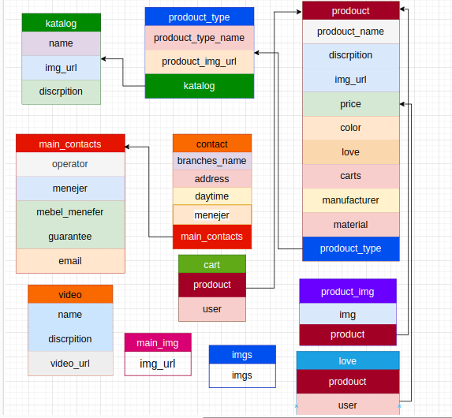

# Dafna doc


### Dafna
<h1 id = 'base'>base url <a href='https://ogabek007.pythonanywhere.com'><u><i>https://ogabek007.pythonanywhere.com/</i></a></a></h1>

| method | endpoint | descriptoin |
|--------|----------|-------------|
| POST | <a href = "#add_katalog">`add_katalog/`</a>| add katalog |
| POST | <a href = "#updeate_katalog">`updeate_katalog/`</a> | updeate katalog |
| GET  | <a href = "#get_katalog">`get_katalog/`</a> | get katalog |
| GET  | <a href = "#delete_katalog">`delete_katalog/<int:id>/`</a> | delete katalog | 
| POST | <a href = "#add_prodouct_type">`add_prodouct_type/`</a> | add prodouct tupe |
| POST | <a href = "#updeate_prouduct_type">`updeate_prouduct_type/<int:id>/` | updeate prouduct type |
| GET  | <a href = "#get_prodouct_type">`get_prodouct_type/<int:id>/`</a> | get prodouct type |
| GET  | <a href = "#delet_prodouct_tupe">`delet_prodouct_tupe/<int:id>/`</a> | delete prodouct type |
| POST | <a href = "#add_prodouct">`add_prodouct/`</a> | add prodouct |
| POST | <a href = "#updeate_prodouct">`updeate_prodouct/<int:id>/`</a> | updeate prodouct |
| GET  | <a href = "#get_prodouct">`get_prodouct/<int:id>/`</a> | get prodouct |
| GET  | <a href = "#get_prodouct_detail">`get_prodouct_detail/<int:id>/`</a> | get prodouct detail |
| GET  | <a href = "#delete_prodouct">`delete_prodouct/<int:id>/`</a> | delete prodouct |
| POST | <a href = "#add_love">`add_love/`</a> | add love |
| GET  | <a href = "#delete_love">`delete_love/<int:id>/`</a> | delete love |
| POST | <a href = "#add_cart">`add_cart/`</a> |add cart |
| GET  | <a href = "#delete_cart">`delete_cart/<int:id>/`</a> | delete cart |
| GET  | <a href = "#get_cart">`get_cart/`</a> | get cart |
| GET  | <a href = "#get_love">`get_love/`</a> | get love |
| POST | <a href = "#add_video">`add_video/`</a> | add video |
| GET  | <a href = "#delete_video">`delete_video/<int:id>/`</a> | delete video |
| GET  | <a href = "#get_video">`get_video/`</a> | get video |
| POST | <a href = "#add_main_contact">`add_main_contact/`</a> | add main contact |
| POST | <a href = "#updeate_main_contact">`updeate_main_contact/<int:id>/`</a> | updeate main contact |
| GET  | <a href = "#get_main_contact">`get_main_contact/`</a> | get main contact |
| GET  | <a href = "#delet_main_contact">`delet_main_contact/<int:id>/`</a> | delet main contact |
| POST | <a href = "#add_contact">`add_contact/`</a> | add contact |
| POST | <a href = "#updeate_contact">`updeate_contact/<int:id>/`</a> | updeate contact |
| GET  | <a href = "#delete_contact">`delete_contact/<int:id>/`</a> | delete contact |
| GET  | <a href = "#get_contact">`get_contact/<int:id>/`</a> | get contact |
| GET  | <a href = "#delete_all_cart">`delete_all_cart/<int:id>/`</a> | delete all cart |
| GET  | <a href = "#sourt">`sort/<str:name>/`</a> | url to search for products to buy |
| GET  | <a href = '#get_new_prodouct'>`get_new_prodouct`</a> | get new prodoucts on ten |
| GET  | <a href = '#get_rescommentations'>`get_rescommentations`</a> | get rescommentations prodoucts on ten |

<br>
<br>
<hr>


# Model
## you can find this image from [this link](https://app.diagrams.net/#G1Kt5Z4bO88bhWJrlhcsGTbzqfw991eCt7)

<br><br><br><br>
<hr>

<div id="add_katalog"> 

**POST** ```dafna_app/add_katalog/```
### url to add directory


```python
        input:
            {
                "name": str,
                "discrpition": str,
                "img_url":str
            }
        return: json ->
            {
                "id": int,
                "name":str,
                "discrpition": str,
                "img_url":str
            }
        
```
<a href = "#base">^ to the top ^</a> 
</div>
<hr>

<div id="updeate_katalog">
 
**POST** ```dafna_app/updeate_katalog/<int:id>/```
### url to update directory


```python

        input:
            {
                "name":(option) str ,
                "discrpition":(option) str,
                "img_url":(option)str
            }
        return: json ->
            {
                "id": int,
                "name":str
                "discrpition": str,
                "img_url":str
            }
        
```
<a href = "#base">^ to the top ^</a> 
<hr>
</div>
<div id="get_katalog">
 
**GET** ```dafna_app/get_katalog/```
### url to get all of the directory


```python
    input:get request
        return: json->
        {
            "katalogs": [
                {
                "id": int,
                "name":str
                "discrpition": str,
                "img_url":str
                }
            ]
        }
        
```
<a href = "#base">^ to the top ^</a> 
<hr>
</div>
<div id="delete_katalog">
 
**GET** ```dafna_app/delete_katalog/<int:id>/```
### url to delete the directory


```python
    input:get request dafna_app/delete_katalog/<id>/
    return:json->{"OK delete":"200"}
        
```
<a href = "#base">^ to the top ^</a> 
<hr>
</div>
<div id="add_prodouct_type">
 
**POST** ```dafna_app/add_prodouct_type/```
### url to add product type
 
```python

        input:json->{
            "name": str,
            "img_url":str,
            "katalog":int katalog id int
            }
        return:json->{
            "id":int
            "name": str,
            "img_url":str,
            "katalog":int katalog id int
            }
        
```
<a href = "#base">^ to the top ^</a> 
<hr>
</div>
<div id="updeate_prouduct_type">
 
**POST** ```dafna_app/updeate_prouduct_type/<int:id>/```
### url to update product type

```python

        input:json->
        {
            "name":(options)str,
            "img_url": (options)str,
        }
        return:json->
        {
            "id": int,
            "name":str,
            "img_url": str,
            "katalog": int
        }
        
```
<a href = "#base">^ to the top ^</a> 
<hr>
</div>
<div id="get_prodouct_type">
 
**GET** ```dafna_app/get_prodouct_type/<int:id>/```
### url to get the product type

```python
        input:request get dafna_app/get_prodouct_type/id/
        return:json->
        {
            "id": int,
            "name":str,
            "discrpition": str,
            "img_url":str,
            "prodouct_typt": [
                {
                    "id": int,
                    "name": str,
                    "img_url": str,
                    "katalog": int
                },
            ]
        }
        
```
<a href = "#base">^ to the top ^</a> 
<hr>
</div>
<div id="delet_prodouct_tupe">
 
**GET** ```dafna_app/delet_prodouct_tupe/<int:id>/```
### url to delete product type

```python
    input:get request dafna_app/delet_prodouct_tupe/id/
    return:json->{"OK delete":"200"}
        
```
<a href = "#base">^ to the top ^</a> 
<hr>
</div>
<div id="add_prodouct">
 
**POST** ```dafna_app/add_prodouct/```
### url to create the product


```python
    input:json->
        {
            "name": str,
            "discrpition": str,
            "img_url":str
            "price":int,
            "color": str,
            "manufacturer":str,
            "material": str,
            "prodouct_type": int
        }
    return:json->
        {
            "id":int
            "name": str,
            "discrpition": str,
            "img_url":str,
            "price":int,
            "color": str,
            "manufacturer":str,
            "material": str,
            "prodouct_type": int
        }
```
<a href = "#base">^ to the top ^</a> 
<hr>
</div>
<div id="updeate_prodouct">
 
**POST** ```dafna_app/updeate_prodouct/<int:id>/```
### url to update prodouct


```python
        
        input:post request
        {
            "name": (option)str,
            "discrpition": (option)str,
            "img_url": (option)str,
            "price": (option)int,
            "color": (option)str,
            "manufacturer": (option)str,
            "material": (option)str,
            "prodouct_type": (option)int
        }
        return:json->
        {
            "id": int,
            "name": str,
            "discrpition": str,
            "img_url":str,
            "price": int,
            "color":str,
            "manufacturer": str,
            "material": str,
            "prodouct_type": int
        }
```
<a href = "#base">^ to the top ^</a> 
<hr>
</div>
<div id="get_prodouct">
 
**GET** ```dafna_app/get_prodouct/<int:id>/```
### url to read prodouct


```python
    input:get request dafna_app/get_prodouct/id/
    return:json->
        
        input:get request dafna_app/get_prodouct/id/
        return:json->
        {   
            "id":int,
            "name": str,
            "discrpition": str,
            "img_url": str,
            "prodouct_type": {
                "id":int,
                "name": str,
                "img_url": str,
                "prodoucts": [
                    {
                        "id": int,
                        "name": str,
                        "discrpition": str,
                        "img_url": str,
                        "price": int,
                        "color": str,
                        "manufacturer": str,
                        "material": str,
                        "prodouct_type": int
                    }
                ]
            }
        }
```
<a href = "#base">^ to the top ^</a> 
<hr>
</div>
<div id="delete_prodouct">
 
**GET** ```dafna_app/delete_prodouct/<int:id>/```
### url to delete prodouct


```python
    input:get request dafna_app/delete_prodouct/id/
    return:json->{"OK delete":"200"}
```
<a href = "#base">^ to the top ^</a> 
<hr>
</div>
<div id="add_love">
 
**POST** ```dafna_app/add_love/```
### url to add love


```python
    input:json->
            {
                "prodouct": int product id
            }
    return:json->
            {
                "id":int
                "prodouct": int product id
            }      
```
<a href = "#base">^ to the top ^</a> 
<hr>
</div>
<div id="get_love">
 
**GET** ```dafna_app/get_love/```
### url to get love


```python
    input:get request
    return:json->
        {
            "loves": [
                {
                    "id": 5,
                    "name": "Aylanadigan stol",
                    "discrpition": "Ofis uchun Aylanadigan stollar to'plam",
                    "img_url": "nada",
                    "price": 4500000,
                    "color": "qora",
                    "manufacturer": "uz",
                    "material": "charim",
                    "prodouct_type": 3,
                    "love_id": 1
                }
            ]
        }
        
```
<a href = "#base">^ to the top ^</a> 
<hr>
</div>
<div id="delete_love">
 
**GET** ```dafna_app/delete_love/<int:id>/```
### url to delete love


```python
    input:get request /dafna_app/delete_love/id/
    return:{"OK delete":"200"}
        
```
<a href = "#base">^ to the top ^</a> 
<hr>
</div>
<div id="add_cart">
 
**POST** ```dafna_app/add_cart/```
### url to add cart


```python
    input:json->
            {
                "prodouct": int
            }
    return:json->
            {
                "add cart":"ok"
            }
        
```
<a href = "#base">^ to the top ^</a> 
<hr>
</div>
<div id="delete_cart">
 
**GET** ```dafna_app/delete_cart/<int:id>/```
### url to delete cart


```python
    input:get request /dafna_app/delete_cart/id/
    return:{"OK delete":"200"}
```
<a href = "#base">^ to the top ^</a> 
<hr>
</div>
<div id="delete_all_cart">
 
**GET** ```dafna_app/delete_all_cart/<int:id>/```
### url to delete all carts


```python
    input:get request /dafna_app/delete_all_cart/id/
    return:{"OK delete":"200"}
        
```
<a href = "#base">^ to the top ^</a> 
<hr>
</div>
<div id="get_cart">
 
**GET** ```dafna_app/get_cart/```
### url to get carts


```python
    input:get request
    return:json->
        {
            "carts": [
                {
                    "id": int,
                    "name": str,
                    "discrpition": str,
                    "img_url": str,
                    "price": int,
                    "color": str,
                    "manufacturer": str,
                    "material": str,
                    "prodouct_type": int
                }
            ]
        }
```
<a href = "#base">^ to the top ^</a> 
<hr>
</div>
<div id="get_love">
 
**GET** ```dafna_app/get_love/```
### url to get loves


```python
        input:get request
        return:json->
        {
            "loves": [
                {
                    "id": 5,
                    "name":str,
                    "discrpition": str,
                    "img_url":str,
                    "price": itn,
                    "color": str,
                    "manufacturer": str,
                    "material":str,
                    "prodouct_type": int,
                    "love_id": int
                }
            ]
        }
        
```
<a href = "#base">^ to the top ^</a> 
<hr>
</div>
<div id="add_video">
 
**POST** ```dafna_app/add_video/```
### url to add video


```python
        
        input:json->
        {
            "name": str,
            "discrpition": str,
            "video_url": str
        }
        return:json->
        {
            "id": 1,
            "name": str,
            "discrpition": str,
            "video_url": str
        }
```
<a href = "#base">^ to the top ^</a> 
<hr>
</div>
<div id="delete_video">
 
**GET** ```dafna_app/delete_video/<int:id>/```
### url to delete video

```python

        input:get request /dafna_app/delete_video/id/
        return:{"OK delete":"200"}
        
```
<a href = "#base">^ to the top ^</a> 
<hr>
</div>
<div id="get_video">
 
**GET** ```dafna_app/get_video/```
### url to get video

```python
        
        input:get request
        return:json->
        {
            "videos": [
                {
                    "id": int,
                    "name": str,
                    "discrpition":str,
                    "video_url": str
                }
            ]
        }
```
<a href = "#base">^ to the top ^</a> 
<hr>
</div>
<div id="add_main_contact">
 
**POST** ```dafna_app/add_main_contact/```
### url to create main contact


```python

        input:json->
        {
            "operator": str,
            "menejer": str,
            "mebel_menejer": str,
            "guarantee":int,
            "email": str email
        }
        return:json->
        {
            "id":int,
            "operator": str,
            "menejer": str,
            "mebel_menejer": str,
            "guarantee":int,
            "email": str email
        }
        
```
<a href = "#base">^ to the top ^</a> 
<hr>
</div>
<div id="updeate_main_contact">
 
**POST** ```dafna_app/updeate_main_contact/<int:id>/```
### url to updeate main contact


```python

        input:json->
        {
            "operator": str,
            "menejer": str,
            "mebel_menejer":str,
            "guarantee": int,
            "email": str email
        }
        return:json->
        {
            "id": int,
            "operator": str,
            "menejer": str,
            "mebel_menejer":str,
            "guarantee": int,
            "email": str email
        }
        
```
<a href = "#base">^ to the top ^</a> 
<hr>
</div>
<div id="get_main_contact">
 
**GET** ```dafna_app/get_main_contact/```
### url to get main contact


```python
        
        input:get request
        return:json->
        {
            "main_contacts": [
                {
                    "id": int,
                    "operator": str,
                    "menejer": str,
                    "mebel_menejer": str,
                    "guarantee": int,
                    "email":str email
                }
            ]
        }
```
<a href = "#base">^ to the top ^</a> 
<hr>
</div>
<div id="delet_main_contact">
 
**GET** ```dafna_app/delet_main_contact/<int:id>/```
### url to delete main contact


```python
        
        input:get request /dafna_app/delete_main_contact/id/
        return:{"OK delete":"200"}
```
<a href = "#base">^ to the top ^</a> 
<hr>
</div>
<div id="add_contact">
 
**POST** ```dafna_app/add_contact/```
### url to create contact


```python
        
        input:json->
        {
            "branches_name": str,
            "datetime":(option)ditetime,
            "address":str,
            "menefer": str,
            "main_contacts": int
        }
        return:json->
        {
            "id":int,
            "branches_name": str,
            "datetime":ditetime,
            "address":str,
            "menefer": str,
            "main_contacts": int
        }
```
<a href = "#base">^ to the top ^</a> 
<hr>
</div>
<div id="updeate_contact">
 
**POST** ```dafna_app/updeate_contact/<int:id>/```
### url to updeate contact

```python
        
        input:json->
        {
            "branches_name": (option)str,
            "datetime":(option)ditetime,
            "address":(option)str,
            "menefer": (option)str,
            "main_contacts": (option)int
        }
        return:json->
        {
            "id":int,
            "branches_name": str,
            "datetime":ditetime,
            "address":str,
            "menefer": str,
            "main_contacts": int
        }
```
<a href = "#base">^ to the top ^</a> 
<hr>
</div>
<div id="delete_contact">
 
**GET** ```dafna_app/delete_contact/<int:id>/```
### url to delete contact

```python

        input:get request /dafna_app/delete_contact/id/
        return:{"OK delete":"200"}
        
```
<a href = "#base">^ to the top ^</a> 
<hr>
</div>
<div id="get_contact">
 
**GET** ```dafna_app/get_contact/```
### url to get contact

```python
        
        input:get request
        return:json->
        {
            "contacts": [
                {
                    "id": int,
                    "branches_name": str,
                    "address": str,
                    "datetime": datetime str,
                    "menefer": str,
                    "main_contacts": int
                }
            ]
        }
```
<a href = "#base">^ to the top ^</a> 
<hr>
</div>
<div id="sourt">
 
**GET** ```dafna_app/sort/<str:name>/```
### url to search for products to buy


```python
        
        input:get request
        return:json->
        [
            "sorts":
            [
                {
                    "id": int,
                    "name": str,
                    "discrpition": str,
                    "img_url": str,
                    "price": int,
                    "color": str,
                    "manufacturer": int,
                    "material": str,
                    "prodouct_type": int
                }
            ]
        ]

        or:json->
        {
            "sort": "None"
        }
```
<a href = "#base">^ to the top ^</a> 
<hr>
</div>


<div id="get_new_prodouct">
 
**GET** ```dafna_app/get_new_prodouct/```
### ten of the newest products url to return

```python
        
        input:get request
        return:json->
        {
            "prodoucts": [
                {
                    "id": int,
                    "name": str,
                    "discrpition": str
                    "img_url": str,
                    "price": int,
                    "color": str,
                    "manufacturer": str,
                    "material": str,
                    "prodouct_type": int
                }
            ]
        }
```
<a href = "#base">^ to the top ^</a> 
<hr>
</div>

<div id="get_rescommentations">
 
**GET** ```dafna_app/get_rescommentations/```
### ten of the rescommentations products url to return

```python
        
        input:get request
        return:json->
        {
            "prodoucts": [
                {
                    "id": int,
                    "name": str,
                    "discrpition": str
                    "img_url": str,
                    "price": int,
                    "color": str,
                    "manufacturer": str,
                    "material": str,
                    "prodouct_type": int
                }
            ]
        }
```
<a href = "#base">^ to the top ^</a> 
<hr>
</div>
<div id="get_prodouct_detail">
**GET** ```dafna_app/get_prodouct_detail/<int:id>/```
### url to get prodouct detail

```python
        
        input:get request
        return:json->
        {
            "prodouct": {
                "id": int,
                "name": str,
                "discrpition": str,
                "img_url": str,
                "price": int,
                "color": str,
                "manufacturer": str,
                "material": str,
                "prodouct_type": int
            }
        }
```

...
